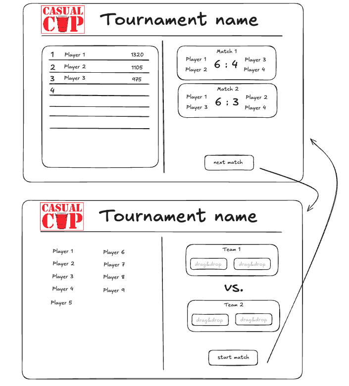

# Casual Cup - The open tournament planning tool

Casual Cup aims to create accessible, low friction tournaments in a casual setting. 
  **Requirements:**
- flexible fixtures, anyone can play with anyone against anyone in 2v2. the only prohibited thing is repeated match fixtures. it remains to decide if both teams have to be the same as a previous game to be uneligible for a scoring match or if the same two players in one team are uneligible. 
- all players are ranked in one tournament table, each player has an ELO-rating, the player with the highest ELO-score and at least three scoring matches wins.
- Elo-score calculation is up for debate, key calculation factors include: own score, teammates score, opponents scores, lose/win, score difference
- tournament data is (for now) stored in the browsers localStorage

